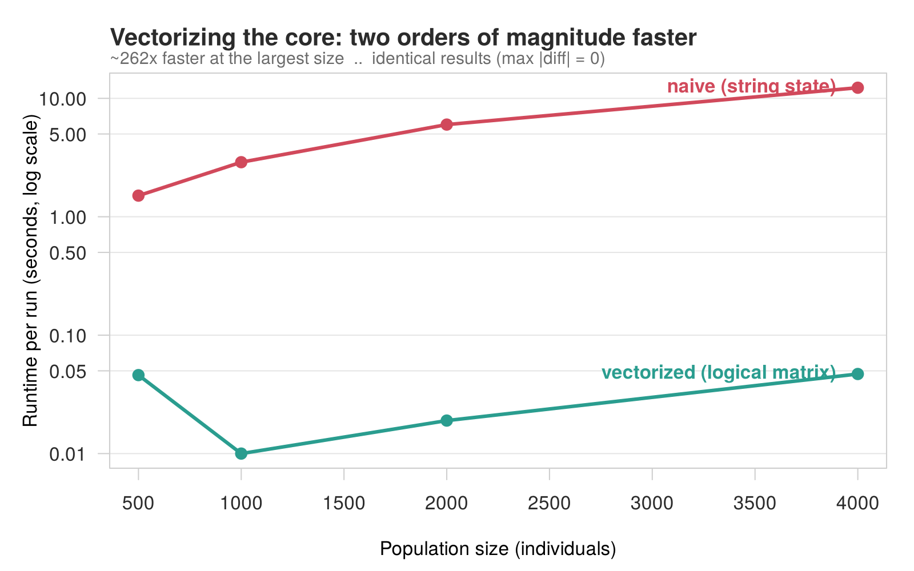
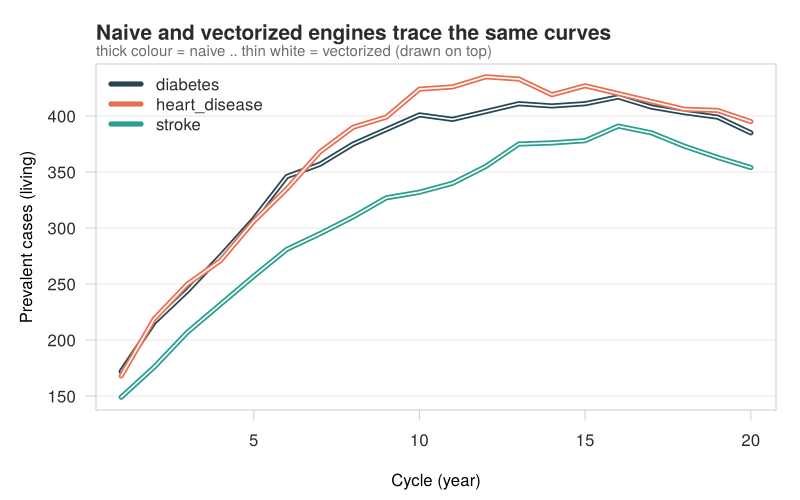
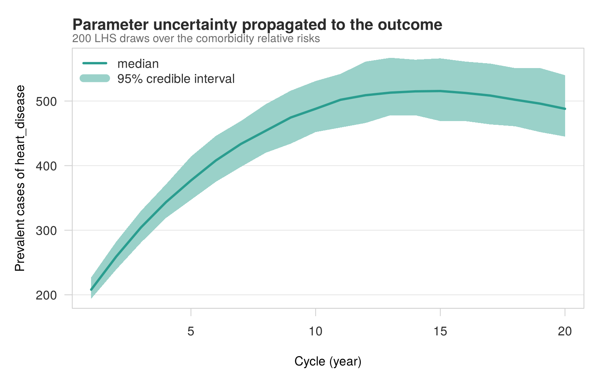
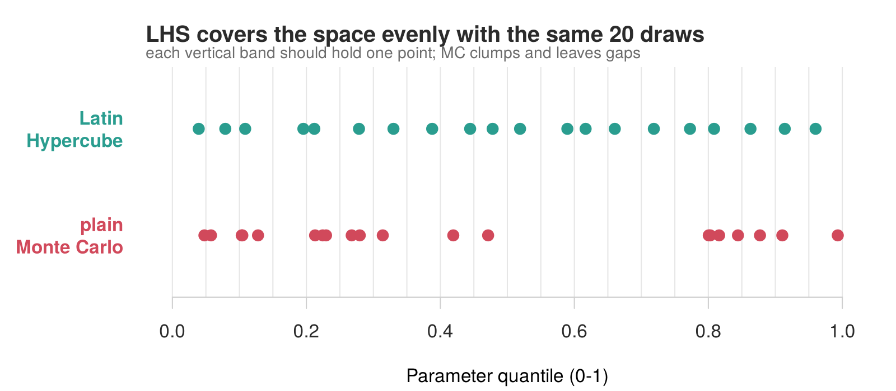

# Fast Health Micro-simulation — Vectorized Core + Uncertainty


A small, self-contained demo of a **health micro-simulation** whose compute
core was re-written for speed — turning a readable-but-slow engine into a
**vectorized** one that is **~100–300× faster and produces identical
results** — and wrapped in an **uncertainty layer (LHS / PSA)** that reports
credible intervals instead of a single point estimate.

Everything runs on **synthetic data generated on the fly** and uses **base R
only** (no packages to install). Clone it, run two scripts, get the figures
below.

> This is a simplified, fully synthetic showcase of a real optimization I did
> on a production health micro-simulation: the technique (string state →
> integer/logical matrix, per-person loops → whole-column vector ops) and the
> uncertainty layer are the same; the model and all numbers here are toy.

---

## The idea in one picture

A micro-simulation steps a synthetic population through time: each year every
individual can develop diseases or die, with risks driven by age, sex, personal
exposure, and comorbidities. Written naively, each person's state is a **string**
(`"diabetes depression"`) updated in a per-person loop — correct, but slow. The
fast engine stores state as a **logical matrix** (individuals × diseases) and
updates whole columns at once.



Same model, same transition rule `p = 1 − exp(−(rate × exposure × comorbidity))`,
**bit-identical output** — the naive and vectorized engines trace the same curves:



## Uncertainty: from a point estimate to a credible interval

Real inputs (here, the comorbidity relative risks) are uncertain. **PSA**
(Probabilistic Sensitivity Analysis) re-runs the model many times, drawing those
parameters from their confidence intervals, to produce a median and a 95%
credible band. **Latin Hypercube Sampling (LHS)** picks those draws efficiently,
covering the parameter space evenly with far fewer runs than plain Monte Carlo.



Why LHS instead of plain Monte Carlo? With the same number of draws, LHS spreads
them evenly (one per stratum) instead of clumping and leaving gaps:



---

## Run it

```r
# from the project root, base R only — nothing to install
Rscript scripts/01_benchmark.R   # speed + equivalence  -> figures/ + results_benchmark.csv
Rscript scripts/02_psa.R         # LHS/PSA intervals     -> figures/ + results_psa.csv
```

Or reproduce the whole thing, figures and narrative, as one HTML report:

```bash
quarto render report.qmd         # -> report.html   (needs Quarto + R)
```

## What's inside

| Path | What it is |
|------|------------|
| `R/simulate_data.R` | Synthetic population, rates, comorbidity structure |
| `R/engine_naive.R`  | The "before" engine — string state, per-person loops |
| `R/engine_fast.R`   | The "after" engine — logical matrix, vectorized |
| `R/psa.R`           | Latin Hypercube Sampling + PSA driver + summaries |
| `scripts/01_benchmark.R` | Speed benchmark + equivalence check (+ figures) |
| `scripts/02_psa.R`  | Uncertainty intervals (+ figures) |
| `report.qmd`        | Reproducible Quarto report tying it all together |
| `figures/`          | Generated PNGs (committed so the README renders) |
| `.claude/`          | A Claude Code skill + `CLAUDE.md` for assisted runs |

## The optimization, in two lines

```r
# naive: per-person loop + string parsing, every cycle
cf <- vapply(seq_len(n), function(i) comorb_rr(state[i], d, comorb), numeric(1))

# fast: whole-column logical ops, no loop, no strings
cf <- rep(1, n); for (r in rows) cf <- cf * ifelse(H[, risk_col[r]], rr[r], 1)
```

## License

MIT — see [LICENSE](LICENSE).
